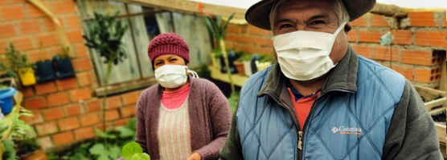

Information related to Novel Coronavirus (COVID-19)

See also FAO’s [dedicated site to Novel Coronavirus (COVID-19)]http://www.fao.org/2019-ncov/en/) which includes useful policy tools, key messages, useful and related links including policy briefs which present qualitative and quantitative assessments of the impacts of the pandemic in certain areas such as food value chains, healthy diets, humanitarian and food crisis contexts, agri-food markets and trade.
